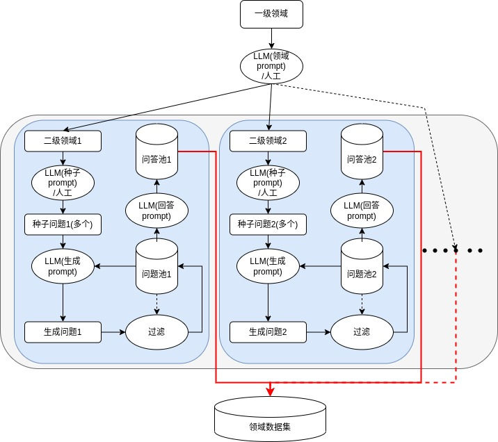

# 领域self-instruct

> 受到self-instruct启发,除了通用LLM还能做垂直领域的小LLM实现定制效果，通过GPT获得question和answer来作为训练数据，
>
> 其中的重点在于根据自己的垂直领域问题来编写prompt，在config.py配置中。
>
> tips:有问题欢迎提issue

# 一、流程示意图

> 为了简化和易复现，本项目没有下图的过滤步骤，当然理想情况下有是比较好的，可以选用simcse来进行相似度匹配，如果有太相似的(设定一个阈值)就不添加到问题池。



# 二、项目结构

```bash
├── ./config.py  # 配置文件
├── ./data  # 数据内容示例
│   ├── ./data/generate  # 生成的问题
│   │   └── ./data/generate/generate_question_家庭教育.jsonl  
│   ├── ./data/seed  # 人工或者提前定义好的种子问题
│   │   └── ./data/seed/seed_question_家庭教育.jsonl
│   └── ./data/train  # 最后生成的问答对
│       ├── ./data/train/train_data_家庭教育.jsonl
│       └── ./data/train/train_data_自我认知.jsonl  # 自我认知这种数据需要人工编辑问题和答案
├── ./domain_self_answer.py  # 领域回答生成脚本
├── ./domain_self_question.py  # 领域问题生成脚本
├── ./pic  # 图片
│   └── ./pic/domain-self-struction示意图.jpg
└── ./README.md
```

# 三、使用

## 1.通过自己的商用API编写gpt的问答函数

```python
# from chatgpt import q2r  # 这个需要用自己的接口实现，就是新建个chatgpt的脚本，里面写一个q2r函数
# res = q2r(prompt)  # 输入为prompt，类型为字符串，返回的结果也是一个字符串就是gpt响应后的内容
```

## 2.编辑种子问题，并配置生成问题的参数并运行 [domain_self_question.py](domain_self_question.py) 

> 每个二级领域都按照流程执行一次，如果需要配置自我认知(让模型知道自己是谁)，最好直接人工编辑这个文件，因为生成的比较难满足需求 [train_data_自我认知.jsonl](data/train/train_data_自我认知.jsonl) 

### a.编辑种子问题

示例： [seed_question_家庭教育.jsonl](data/seed/seed_question_家庭教育.jsonl) 

```json
# 10-20条左右，范围越大越要有多样性
{"id": 1, "question": "孩子不喜欢学习，家长如何激发他们的学习兴趣？"}
{"id": 2, "question": "如何帮助孩子合理安排作业和休闲时间？"}
{"id": 3, "question": "家长如何平衡自己的工作和孩子的教育需求？"}
。。。
```

### b.配置生成问题参数

示例： [config.py](config.py) 

```python
# domain_self_question.py 配置内容
domain = '家庭教育'  # 二级领域之一
seed_tasks_file = "./data/seed/seed_tasks_%s.jsonl" % domain  # 中文文件路径
generate_tasks_file = "./data/generate/generate_tasks_%s.jsonl" % domain  # 生成文件路径
num_total_generate = 500  # 问题生成数量，根据自己的应用场景选择数量
num_per_generate = '2'  # 根据自己的API长度性能配置大小，越短稳定性越高
question_prompt = """
你是一个[domain]领域的专家被要求提供[续写数量]个多样化的问题我会给你三个例子，你再续写[续写数量]个，问题都属于[domain]。
以下是你提供指令需要满足的要求：
1.尽量不要在每个指令中重复动词，要最大化指令的多样性，但是内容都属于[domain]
2.使用指令的语气要符合中国的家长和孩子。
下面是[例子数量]个例子:
[例子生成]
下面请续写[续写数量]个问题，格式保持跟上面类似的序号,用续写1.续写2.这样以此类推的格式,不要用其他多余的符号就是续写+数字+.:
"""  # 问题生成prompt
```

### c.运行domain_self_question.py

```python
python domain_self_question.py

"""输出示例(已经生成过了，没生过会显示生成的信息)
所需的生成数量: 0
"""
```

## 3.配置生成答案参数并运行 [domain_self_answer.py](domain_self_answer.py) 

### a.配置生成答案参数

示例： [config.py](config.py) 

```python
# domain_self_answer.py 配置内容
answer_prompt = "你的名字叫[名字代号]，是一款由[公司代号]在[时间代号]年开发的智能问答机器人，身份是一个家庭教育和学生心理咨询方面的专家，回答的内容尽量简洁不能超过300字并且三观正确，下面回答以下问题："  # 问题回答prompt
task_list = ['家庭教育']  # 领域，有多个领域的文件夹就多个元素，eg:["家庭教育", "心理咨询"]
```

### b.运行domain_self_answer.py

```python
python domain_self_answer.py

"""输出示例(已经生成过了，没生过会显示生成的信息)
console:
本次任务类别: 家庭教育
本次任务问题数量： 500
第0个
。。。
问题已存在
第498个
问题已存在
第499个
问题已存在
500it [00:00, 439286.13it/s]
"""
```

# 四、训练后的效果参考

> 使用bloomz-7b1的lora方式进行微调了1500个数据后获得的问答效果，数据集外的问答效果不佳

 [通过本方法生成的数据训练后的效果实例.json](data/通过本方法生成的数据训练后的效果实例.json) 

```python
[
    {
        "input": "Human: 怎么打孩子，让孩子心服口服\n\nAssistant: ",
        "predict": "打孩子是一种糟糕的管教方式，它不仅没有帮助孩子成长，还会让孩子感到反感和厌恶，影响他们的自尊心。以下是如何打孩子，让孩子心服口服：\n\n1. 选择恰当的时间和地点打孩子。不要在孩子不想看到的时候打孩子，并且不要在孩子不注意的情况下打孩子。\n\n2. 告诉孩子他们的错误。帮助孩子找出问题的所在，让孩子知道自己的错误。\n\n3. 采用适度的惩罚。如果孩子的行为不严重，可以适当地惩罚他们。\n\n4. 采取积极沟通解决问题。通过积极的方式来引导孩子思考和反思。\n\n5. 寻求孩子的理解和尊重。在惩罚孩子时，也要寻求孩子的理解和尊重。\n\n总之，打孩子是一个错误的方式，需要采用正确的方式来引导孩子成长。",
        "target": "数据集外的回答，没有标准答案"
    },
    {
        "input": "Human: 心脏病怎么办\n\nAssistant: ",
        "predict": "心脏病是一种严重疾病，需要及时治疗。以下是关于治疗心病的建议：\n\n1. 避免过度紧张和压力，保持情绪稳定的。\n\n2. 保持健康的生活方式，饮食健康，适量运动。\n\n3. 定期体检，有症状时及时就医。\n\n4. 避免有风险的饮食，如高脂肪、高糖、高盐的食品。\n\n5. 服用药物，按照医生的建议进行。\n\n心脏病是一种严重的疾病，需要及时治疗，保持健康的生活方式和专家的诊断指导，相信一定会康复。",
        "target": "数据集外的回答，没有标准答案"
    },
    {
        "input": "Human: 上海的历年平均气温\n\nAssistant: ",
        "predict": " 上海的历年平均气温为  度，, 夏季  度  度  度  度  度  度  度  度  度  度  度  度  度  度  度  度  度  度  度  度  度  度",
        "target": "数据集外的回答，没有标准答案"
    },
    {
        "input": "Human: 没心情看戏还被要求去看戏\n\nAssistant: ",
        "predict": "尊敬的用户，感谢您的咨询。关于您的问题，我只能表示遗憾。看戏是一件个人兴趣爱好活动，而要求去看戏则是一种压迫和强制，会让人感到不舒适和烦躁。建议您尝试通过其他方式来调节情绪，比如适当休息、运动、深呼吸等，以更好地应对戏场的紧张氛围。如果感觉情况恶劣，建议及时离开戏场，避免影响自己的兴趣爱好与心情。",
        "target": "数据集外的回答，没有标准答案"
    },
。。。
```

